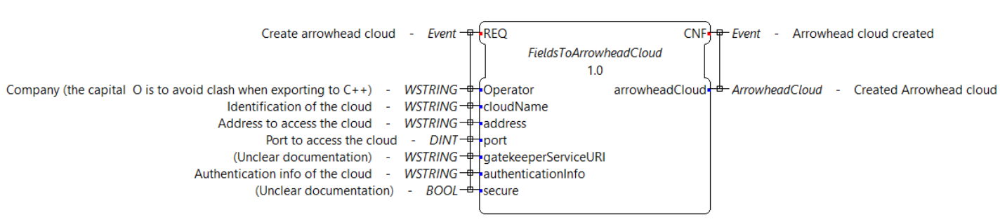
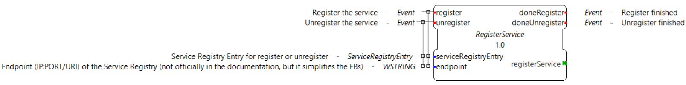
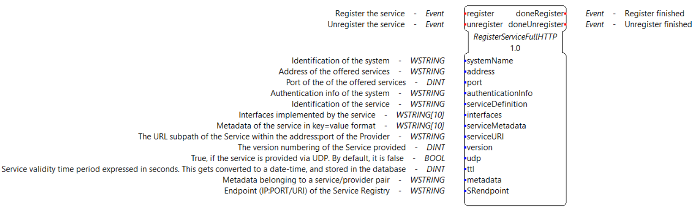

= [[topOfPage]]How to use 4diac's Arrowhead library

== [[intro]]Introduction

4diac FORTE supports communication with the ServiceRegisty, Orchestrator, Authorization and EventHandler core system of the Arrowhead Framework version 4.1.2 using HTTP-JSON and OPCUA-JSON.

The https://github.com/arrowhead-f/core-java[Arrowhead Framework (AF)] is a framework that provides interoperability between services in a Service Oriented Architectue (SOA). 
The actual scope and its definition are not easy to understand at first and its documentation does not always help, so the following paragraph will try explain the basics of the AF.

The AF is a set of interfaces, rules and documentation system that allow devices to provide and consume services. 
The AF defines types in an abstract way for Services, Cloud, System and others concepts.

The AF also stablish that there should be at least 3 main systems (also called core systems) in a local cloud: 
ServiceRegistry system (allows to register, unregister and query for services), Orchestrator system (allows to find provided services that were designated to devices to consume) and the Authorization System (manages all authorization needed between devices and services). 
These systems, together with others that aren't mandatory, provide a set of defined services, which of course are defined using the interfaces and types of the AF. 
The documentation of each system can be found in the folder for it in the https://github.com/arrowhead-f/core-java/tree/master/documentation[github repository]. 
It's important to note at this point that all services defined for the core systems are implementation-independent, but HTTP/JSON is the first and the de-facto official implementation, but the services could use other communication and modeling protocols.

The service that your system will produce or consume is not defined in the AF, but how you should document it, it is.

The basic sequence for having a service being produced and consumed in the AF is the following:

. Configure your local cloud: First, you need to tell the Authorization System which services are allowed to be consumed by which system and to the Orchestrator System where are the sevice providers for the consumers (IP and Port).
. When the service provider is connected to the local cloud, it should register to the Service Registry.
. The service consumer will do the same. In addition, it will contact the Orchestrator asking for the endpoint of the service provider.
. The Orchestrator will look in its private database (configured in point 1) for the endoint of the service provider, and check with the Authorization System if the consumer is allowed to consume from the provider.
. If yes, the Orchestrator answers the consumer (point 3) with the endpoint of the service provider.
. The service consumer connects to the service provider using the endpoint given in point 5, and consumes the services.

As seen before, the service interface between the consumer and provider is not fixed and the AF has nothing to do with it. The AF provides the support to register services, and look for them.

IMPORTANT: The developed 4diac's Arrowhead library provides the FBs and AF types to communicate to the official https://github.com/arrowhead-f/core-java[Arrowhead Framework] version 4.1.2. 
The new version 4.1.3 of the AF is in another repository and the API has changed so it's not compatible with the 4diac's library. 
The provided library can be used with HTTP using the provided link before, or OPC UA, but for that you need to use this special fork which extends the AF with OPC UA interfaces.

== Enabling the Arrowhead Module in 4diac FORTE 

The first thing that's needed is to have a version of 4diac FORTE with the Arrowhead Module enabled. For that, you'll need to compile your own 4diac FORTE. 
To do that, follow these xref:../installation/install.adoc#ownFORTE[steps] and in CMake set the variable `FORTE_MODULE_Arrowhead` and `FORTE_COM_HTTP` or/and `FORTE_COM_OPC_UA` to TRUE.

After 4diac FORTE compiles, you'll be ready to use the FBs library in 4diac IDE.

== FBs in 4diac IDE

The 4diac IDE is where the library of Function Blocks were defined, and it was done in three levels. 
In the lowest level, helper Function Blocks allow the user to create the Arrowhead Framework types using standard types from IEC 61499. 
The following figure shows the Function Block to create an Arrowhead Cloud type, which can later be connected to the upper levels.

On the second level, the actual Arrowhead services were implemented.
These Function Blocks offer an adapter following the IEC 61499 standard, in order to decouple the abstract definition of services from the actual implementation. 
As an example, the following figure shows the Function Block to register and unregister a service in the Service Registry. 
The data inputs are a Service Registry Entry type (protocol independent) and the endpoint to connect to. 
The “registerService” adapter on the below right side, offers a plug to the actual implementation of the communication, passing all needed data.

The socket for this adapter is given by each implementation. The next figure shows the Function Block that implements the actual HTTP communication to the Service Registry (there's one with the same interface for OPC UA but different internal implementation). 
Its only input is the socket adapter, the counter part of the plug adapter from the previous figure. 
By connecting them, the information is passed to this Function Block that handles the communication.

image:./img/arrowhead/httpRegisterService.png[Register Service implementation in HTTP Rest]

This decoupled architecture allows to quickly implement another type of communication. 
For example, to connect to the Service Registry with an OPC UA interface, only the Function Block in the last figure needed to be re-implemented with the specifics of OPC UA.

On the top most level, sub-applications were implemented in order to facilitate the user using the library. 
For example, for registering a service, instead of building from the lowest level, which requires many Function Blocks and connections, an encapsulated sub-application is provided that offers all parameters for it. 
The following figure shows the sub-application with all parameters to register and unregister a service using HTTP.

== Purpose of available FBs in the Arrowhead Library

The following gives information about the purpose of all FBs and SubApps in the library. 
The parameters of each one of them is documented in the FBs and SubApps itself.

The ones marked like [.specificText]#this text# are the top level, and usually, the only ones that you need in order to quickly use the
library.

* Common
** FieldsToArrowheadCloud: Translate individual fields to an ArrowheadCloud type
** FieldsToArrowheadService: Translate individual fields to an ArrowheadService type
** FieldsToArrowheadSystem: Translate individual fields to an ArrowheadSystem type
** JSON
*** ANYToJSON: Transform 61499 types to JSON format
*** GetArrayResponseFromJSON: Transform a HTTP response to an array
* Service Registry
** FieldsToServiceQueryForm: Translate individual fields to a Service Query Form type
** FieldsToServiceRegistryEntry: Translate individual fields to a Service Registry type
** GetEndpointFromServiceRegistry: Get the IP:PORT/URI endpoint from a Service Registry Entry
** QueryService: Query Service Function Block
** QueryServicesAdp: Query services adapter
** RegisterService: Register Service Function Block
** RegisterServiceAdp: Register Service Adapter
** ServiceRegistryEntry2ServiceRegistryEntry: Helper FB to set the connection to a Service Registry Entry type
** HTTP
*** QueryServiceHTTP: Query for Services using HTTP
*** [.specificText]#QueryServiceHTTPSub: Query services using HTTP with the service defined#
*** [.specificText]#QueryServiceHTTPSubFull: Query services using HTTP with all service's fields to be defined#
*** [.specificText]#RegisterMultipleServicesHTTP: Register many services with different serviceDefinition and serviceURI #
*** [.specificText]#RegisterServiceFullHTTP: Register a Service using HTTP. All possible parameters are available to be set#
*** RegisterServiceHTTP: Register Service using HTTP 
*** [.specificText]#RegisterServicePartialHTTP: Register a Service using HTTP. The system information is encapsulated#
** OpcUa
*** QueryServiceOpcUa: Query for Services using OpcUa
*** [.specificText]#QueryServiceOpcUaSub: Query services using OpcUa with the service defined#
*** [.specificText]#QueryServiceOpcUaSubFull: Query services using OpcUa with all service's fields to be defined#
*** [.specificText]#RegisterMultipleServicesOpcUa: Register many services with different serviceDefinition and serviceURI #
*** [.specificText]#RegisterServiceFullOpcUa: Register a Service using OpcUa. All possible parameters are available to be set#
*** RegisterServiceOpcUa: Register Service using OpcUa
*** [.specificText]#RegisterServicePartialOpcUa: Register a Service using OpcUa. The system information is encapsulated#
* Orchestrator
** FieldsPreferredProvider: Translate individual fields to a PreferredProvider type
** FieldsToServiceRequestForm: Translate individual fields to a ServiceRequestForm type
** [.specificText]#GetEndpointFromOrchestration: Get the IP:PORT/URI endpoint from an Orchestration Form#
** OrchestrationForm2OrchestrationForm: Helper FB to set the connection  to a Orchestration Form type
** OrchestratorRequestAdp: Request orchestration adapter
** RequestOrchestrationForm: Request Orchestration Function Block
** HTTP
*** [.specificText]#GetEndpointFromOrchestrationHTTPPartial: Get the endpoint at INDEX from a request orchestration response#
*** [.specificText]#GetEndpointFromOrchestrationHTTPFull: Get the endpoint at INDEX from a request orchestration response#
*** RequestOrchestrationHTTP: Request Orchestration Function Block using HTTP
*** [.specificText]#RequestOrchestrationHTTPPartial: Request Orchestration using HTTP with all fields from services to be set#
*** [.specificText]#RequestOrchestrationHTTPFull: Request Orchestration using HTTP with all fields from services, system and cloud to be set#
** OpcUa
*** [.specificText]#GetEndpointFromOrchestrationOpcUaPartial: Get the endpoint at INDEX from a request orchestration response#
*** [.specificText]#GetEndpointFromOrchestrationOpcUaFull: Get the endpoint at INDEX from a request orchestration response#
*** RequestOrchestrationOpcUa: Request Orchestration Function Block using OpcUa
*** [.specificText]#RequestOrchestrationOpcUaPartial: Request Orchestration using OpcUa with all fields from services to be set#
*** [.specificText]#RequestOrchestrationOpcUaFull: Request Orchestration using OpcUa with all fields from services, system and cloud to be set#
* Event Handler
** ArrowheadPublish: Publish event Function Block
** ArrowheadPublishAdp: Publish event adapter
** FieldsToArrowheadEvent: Transform individual fields to an Arrowhead Event type
** FieldsToEventFilter: Transform individual fields to an Arrowhead Event Filter type
** FieldsToPublishEvent: Transform individual fields to an Arrowhead Publish Event
** SubscribeEvent: Subscribe Event Function Block
** SubscribeEventAdp: Subscribe event adapter
** HTTP
*** PublishEventHTTP: Publish event using HTTP
*** [.specificText]#PublishEventHTTPFull: Publish Event using HTTP. 
  All possible parameters are available to be set#
*** [.specificText]#PublishEventHTTPPartial: Publish Event using HTTP. 
  The system and event information are encapsulated#
*** SubscribeEventHTTP: Subscribe event using HTTP
*** [.specificText]#SubscribeEventHTTPFull: Publish event using HTTP.
The consumer is encapsulated#
*** [.specificText]#SubscribeEventHTTPPartial:Publish event using HTTP.
The consumer is encapsulated#
** OpcUa
*** PublishEventOpcUa: Publish event using OpcUa
*** [.specificText]#PublishEventOpcUaFull: Publish Event using OpcUa.
All possible parameters are available to be set#
*** [.specificText]#PublishEventOpcUaPartial: Publish Event using OpcUa.
The system and event information are encapsulated#
*** SubscribeEventOpcUa: Subscribe event using OpcUa
*** [.specificText]#SubscribeEventOpcUaFull: Publish event using OpcUa.
The consumer is encapsulated#
*** [.specificText]#SubscribeEventOpcUaPartial:Publish event using
OpcUa. The consumer is encapsulated#

=== Examples and Function Blocks

To see some examples on how the Function Blocks are used, you can check the https://github.com/eclipse-4diac/4diac-examples[Eclipse 4diac examples repository]. 
The FBs are not directly to be found in 4diac IDE, but you'll find them in the example repository.

== Where to go from here?

* Go back to Protocols index: +
xref:index.adoc[Communication Index]
* If you want to go back to the Start Here page, we leave you here a fast access +
xref:../index.adoc[Start Here page]

Or link:#topOfPage[Go to top]
