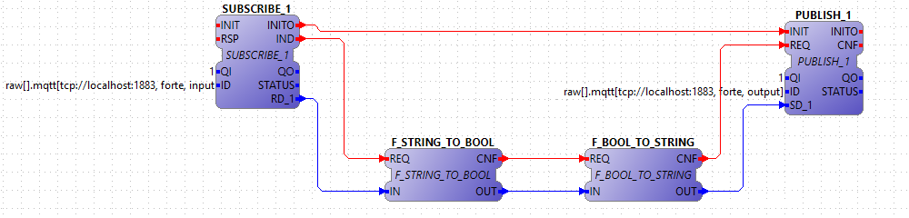

[[topOfPage]]
= MQTT with Eclipse Paho

This section will show you how to make applications communicate using
http://www.eclipse.org/paho/[MQTT Paho]. 4diac FORTE uses a layered
communication architecture. For MQTT Paho, a bottom layer has been
realized, connecting MQTT Paho and the FBDK layer.
[.specificText]#Please consider that with the current implementation it
is not possible to connect to more than one MQTT Paho broker on one
Device#.

Since you need MQTT Paho, you need to install the libraries in your
computer. Therefore you need to download the code and compile it. You
will need the same tools needed for 4diac FORTE (git, cmake, compilers).
The process is based on the normal compilation of 4diac FORTE, but the
MQTT feature is enabled.
link:../../html/installation/install.html#ownFORTE[Here's] a quick link
to 4diac FORTE's compilation. For the installation please follow the
next steps:

. Checkout and build MQTT Paho (if you are using Windows, some commands
might change):
+
$ git clone https://github.com/eclipse/paho.mqtt.c.git $ cd paho.mqtt.c
. Use CMake to generate the files to compile in a similar way you would
use for compiling 4diac FORTE. The options in CMake for Paho are less
and easy to understand. You will export the files to [binPaho]. Then do
+
$ cd [binPaho] $ make
. Configure 4diac FORTE compilation files by starting CMake as you
usually and follow the next steps:
.. Check FORTE_COM_PAHOMQTT in CMake
.. Set [.specificText]#FORTE_COM_PAHOMQTT_INCLUDE_DIR# in CMake to the
folder where the header files of Paho are.
.. Verify that the library specified in
[.specificText]#FORTE_COM_PAHOMQTT_LIB# has the same name as the one you
compiled. If not, change it.
.. Set [.specificText]#FORTE_COM_PAHOMQTT_LIB_DIR# to the folder where
[.specificText]#FORTE_COM_PAHOMQTT_LIB# is located.
.. Configure CMake until nothing is marked red afterwards generate with
CMake.
.. Build 4diac FORTE
. In case you use MQTT Paho on a Virtual Machine use NAT and configure
forwarding for port 1883, which is the default port on a MQTT Paho
broker. IP addresses for the forwarding can be empty.
. To communicate with MQTT Paho use the Publish/Subscribe Function
Blocks of 4diac FORTE and configure its ID data input as follows:
+
raw[].mqtt[tcp://ip:port, cientID, topic]
+

+
[.inlineTitle]#Attention#: When using the raw[] layer in your ID, the
RD_1 of your subscriber and the SD_1 of your publishers must be
connected to a STRING type data. Also, you can only use PUBLISHER_1 and
SUSBCRIBER_1, not others function blocks wit more inputs or outputs.
+
The main reason for this additional "raw" parameter is that mqtt does
not define a payload format. With the additional param you specify in
4diac IDE a so called communication layer to be used on top of MQTT.
This communication layer is now in charge of taking the data from IEC
61499 and generate an according payload format or take the payload and
transform it for the FB's outputs. The raw-layer is just accepting
strings and sends the raw string content.

== Where to go from here?

Go back to Protocols index:

xref:index.adoc[Communication Index]

If you want to go back to the Start Here page, we leave you here a fast
access

xref:../index.adoc[Start Here page]

Or link:#topOfPage[Go to top]
