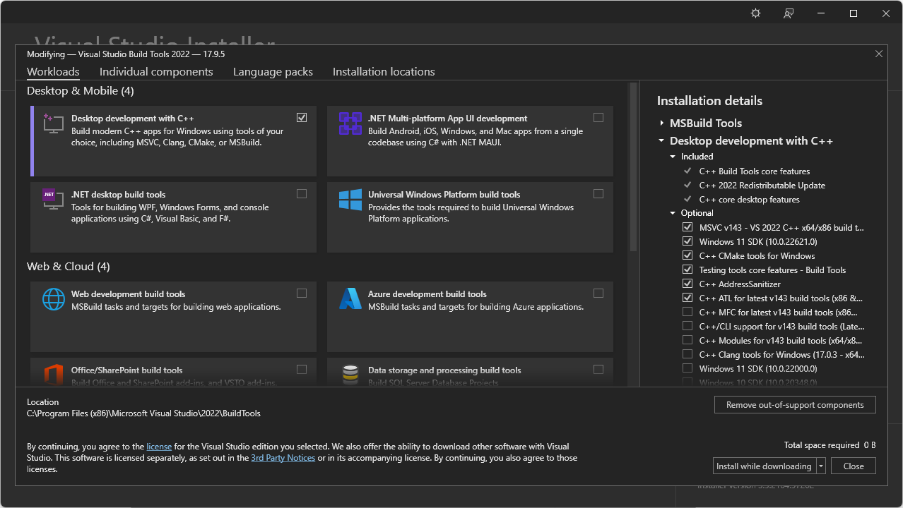
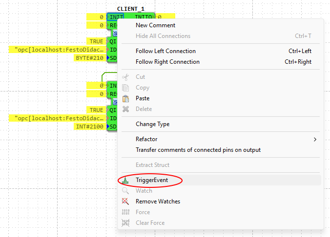
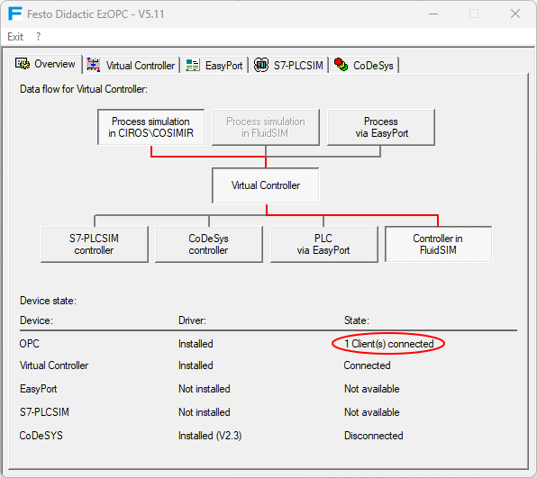
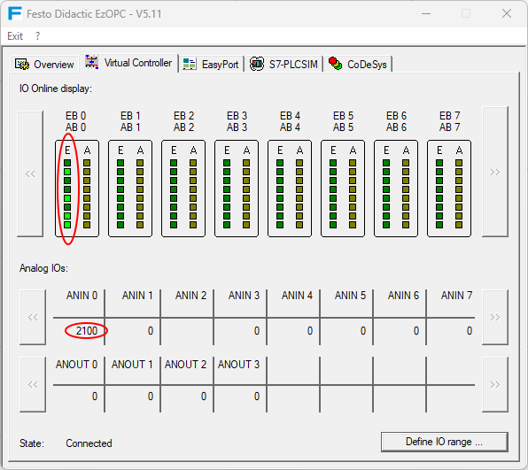

= [[topOfPage]]OPC DA

This section will show you how to create an OPC DA Client with 4diac IDE and how to use it with 4diac FORTE. 
Download the following packages: 

* https://github.com/kumajaya/OPC-Client-X64[OPC Client library] release v0.5.1
* http://www.boost.org[Boost Lexical Cast]
* https://visualstudio.microsoft.com/thank-you-downloading-visual-studio/?sku=BuildTools&rel=17[Visual Studio Installer 2022]

== Prepare and compile OPC Client Toolkit

. Unzip Boost C++ Libraries
. Install Visual Studio Build Tools with the components shown in the below.
  Since https://docs.microsoft.com/en-us/cpp/porting/visual-cpp-change-history-2003-2015?redirectedfrom=MSDN&view=msvc-160#mfc-and-atl[Visual studio 2013], atls.lib and atlsd.lib are unified as atls.lib which together with headers could be detected by the msvc, so that no need to specify in CMakeLists.txt for OPC module.
+

. Clone OPC Client library, check out to develop branch and open the OPC-Client-X64 folder in Visual Studio Code, Visual Studio Code with C/C++ Extension Pack installed should be detect OPC-Client-X64 as a CMake project. Create settings.json file inside .vscode folder as below.
+
----
{
  "cmake.configureOnOpen": false,
  "cmake.configureSettings": {
    "CMAKE_INSTALL_PREFIX": "D:/4diac/OPC-Client-X64/",
    "OPCDACLIENT_TESTING": false
  }
}
----

. Open command palette(ctrl + shift + p), compile in below command:

----
cmake:select a kit;   //choose Visual Studio Build Tools 2022 Release
cmake:select variant; //debug or release
cmake:configure;
cmake:build           //compile
cmake:install         //install
----

== Compile 4diac FORTE with OPC DA Client Support

. Create a MS Visual Studio Code Project of 4diac FORTE with CMake as described in xref:../installation/visualStudioCode.html[Compiling and Debugging 4diac FORTE with MS Visual Studio Code] and add the following variables in `settings.json` which are required for OPC Client support:
* `FORTE_COM_OPC` : ON,
* `FORTE_COM_OPC_LIB_ROOT`: Your path to opc lib root,
* `FORTE_COM_OPC_BOOST_ROOT`: Your path to boost root,
. Open the 4diac FORTE Project with MS Visual Studio Code.
. xref:../installation/visualStudioCode.html[compile or debug] 4diac FORTE

== Create OPC Client

Start the 4diac IDE and create a new [.element61499]#System# with a new [.element61499]#Application# for one [.element61499]#Device#. 
Add a [.specificText]#CLIENT_1# Function Block to the [.element61499]#Application#, set the following input values, and map it to the hardware.

* `QI` = 1
* `ID` = `opc[localhost:FestoDidactic.EzOPC.2:2000:0.01:VirtualPLC.EB0:VirtualPLC.AB0]`
* `SD_1` = `BYTE#210`

whereas the ID input has the following format:
----
opc[host:serverName:updateRate:deadBand:fbInputItems:fbOutputItems]
----

* `host`: address to computer with OPC server
* `serverName`: OPC server name, e.g. `Matrikon.OPC.Simulation`
* `updateRate`: update frequency in milliseconds
* `deadBand`: dead band used for update of value (same unit as value)
* `fbInputItems/fbOutputItems`: items to be added, items should be separated with a comma e.g.

Add a second [.specificText]#CLIENT_1# Function Block to the [.element61499]#Application#, set the following input values, and map it to the hardware.

* `QI` = 1
* `ID` = `"opc[localhost:FestoDidactic.EzOPC.2:2000:0.01:VirtualPLC.Analog.ANIN0:VirtualPLC.Analog.ANOUT0]"`
* `SD_1` = `INT#2100`

Start 4diac FORTE and deploy the Application.
Switch the System into online mode and start watching the in- and outputs. 
For further information about xref:../tutorials/use4diacLocally.adoc#monitoringApplication[Monitoring functionalities] follow the link.

After triggering the INIT event, the OPC-client tries to connect with the OPC-server. 
In this example the OPC-server is `FestoDidactic.EzOPC.2`. 
It is a tool from Festo and can be downloaded https://www.festo.com/de/en/support-portal-specific/?query=EzOPC&groupId=4&productName=EzOPC&documentId=658492[here].

When the connection is established, a window of the server pops up.

Now trigger the REQ event to send the data from client to server.
`BYTE#210` should be send to the server's port `VirtualPLC.EB0`. 
Click to "Virtual Controller" tab to check if the OPC server has received the information.

== Where to go from here?

 * Go back to Protocols index: +
xref:index.adoc[Communication Index]

* If you want to go back to the Start Here page, we leave you here a fast access: +
xref:../index.adoc[Start Here page]

Or link:#topOfPage[Go to top]
