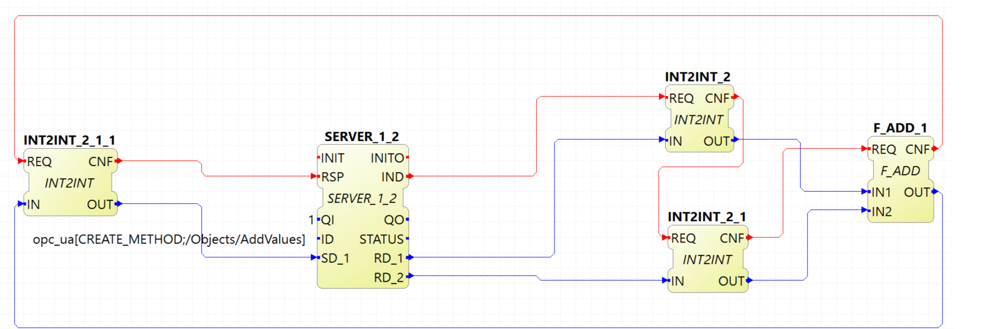
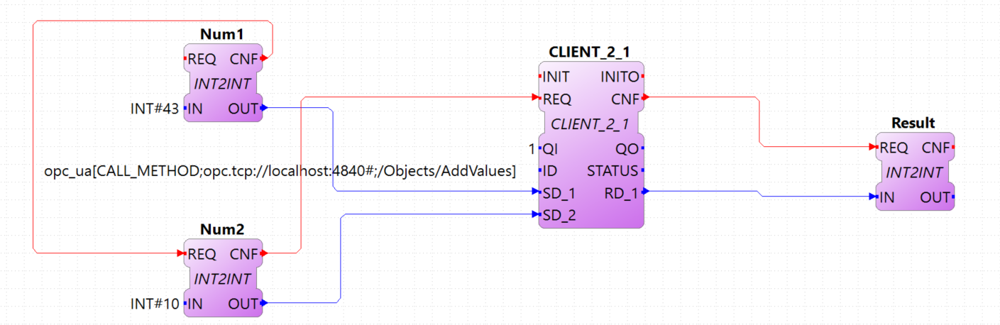

[[topOfPage]]
= OPC UA with IEC 61499 Tutorial

This tutorial shows how you can use
https://en.wikipedia.org/wiki/OPC_Unified_Architecture[OPC UA] in an IEC
61499 Application using available FBs. You should first complete the
link:../../html/4diacIDE/use4diacLocally.html[First Steps in Eclipse
4diac Tutorial] to get familiar with the 4diac IDE. 4diac FORTE uses the
http://open62541.org/[open62541] OPC UA stack which is open source and
can also be used in commercial projects free of charge.

After version 1.11.0 of 4diac FORTE, the OPC UA module has changed its
API, so applications developed before this version won't be compatible.
The changes give more stability to 4diac FORTE and also brings new
features. The OPC UA module can be used with v1.0 of open62541.

Tasks in this tutorial:

. link:#build[Build 4diac FORTE with open62541]
. link:#variables[Provide OPC UA variables to clients]
. link:#methods[Offer an OPC UA method to be called by clients]
. link:#client[Call a remote method from a IEC 61499 Application]
. link:#subscriptions[Create an OPC UA subscription in an IEC 61499
Application]

[[build]]
== Build 4diac FORTE with open62541

OPC UA is not enabled by default in 4diac FORTE. To enable it, you need
to build 4diac FORTE with the open62541 source code yourself.

[.inlineTitle]#Attention#: You need https://www.python.org/[python]
installed on your computer in order to compile the OPCUA library.

=== Linux

. Download the 4diac FORTE source from
http://git.eclipse.org/c/4diac/org.eclipse.4diac.forte.git:
+
$ mkdir ~/4diac && cd "$_" $ git clone -b develop
https://git.eclipse.org/r/4diac/org.eclipse.4diac.forte forte $ cd forte
&& mkdir build
. Download the source for open62541 from
https://github.com/open62541/open62541:
+
$ cd ~/4diac $ git clone https://github.com/open62541/open62541.git
--branch=v1.0 open62541
. Build open62541. If you are running the code on production devices we
suggest setting the build type to [.specificText]#Release#.
+
$ cd ~/4diac/open62541 && mkdir build && cd $_ $ cmake
-DBUILD_SHARED_LIBS=ON -DCMAKE_BUILD_TYPE=Debug
-DUA_ENABLE_AMALGAMATION=ON .. $ make -j
. Set 4diac FORTE to include open62541. If you are running the code on
production devices we suggesst setting the build type to
[.specificText]#Release#.
+
$ cd ~/4diac/forte/build $ cmake -DCMAKE_BUILD_TYPE=Debug \
-DFORTE_ARCHITECTURE=Posix \ -DFORTE_MODULE_CONVERT=ON \
-DFORTE_COM_ETH=ON \ -DFORTE_MODULE_IEC61131=ON \ -DFORTE_COM_OPC_UA=ON
\ -DFORTE_COM_OPC_UA_INCLUDE_DIR=$HOME/4diac/open62541/build \
-DFORTE_COM_OPC_UA_LIB_DIR=$HOME/4diac/open62541/build/bin \
-DFORTE_COM_OPC_UA_LIB=libopen62541.so $ make -j

=== Windows with Visual Studio

. Use a Git tool under Windows and download the 4diac FORTE source from
http://git.eclipse.org/c/4diac/org.eclipse.4diac.forte.git and use the
develop branch. The following steps show the commands for
https://git-for-windows.github.io/[Git Bash].
+
$ mkdir "$HOME/4diac" && cd "$HOME/4diac" $ git clone
https://github.com/open62541/open62541.git --branch=v1.0 open62541 $
mkdir build && cd "build"
. Use CMake to generate all the build files. Download and install:
https://cmake.org/download/
. Open the [.folderLocation]#$HOME/4diac/forte# folder in CMake, and set
the output for the build binaries to the [.folderLocation]#forte/build#
folder.
. Press [.button4diac]#Configure# and select your Visual Studio Version.
(Make sure you select your installed VS version. Otherwise CMake does
not find the C/C++ compiler. Activate [.specificText]#Use default native
compilers#
. Set [.specificText]#FORTE_ARCHITECTURE# to [.specificText]#Win32#,
[.specificText]#FORTE_MODULE_CONVERT=ON#,
[.specificText]#FORTE_MODULE_IEC61131=ON#, and press two times on
cofigure. All red entries should now be gone.
. Build open62541. If you are running the code on production devices we
suggest setting the build type to [.specificText]#Release#. Open a new
CMake window and open the [.folderLocation]#$HOME/4diac/open62541#
folder as source code directory,
[.folderLocation]#$HOME/4diac/open62541/build# as the binaries
directory.
. Press [.button4diac]#Configure# and select your Visual Studio Version.
(Make sure you select your installed VS version. Otherwise CMake does
not find the C/C++ compiler. Activate [.specificText]#Use default native
compilers#
. Activate [.specificText]#BUILD_SHARED_LIBS# and
[.specificText]#UA_ENABLE_AMALGAMATION#
. Press [.button4diac]#Configure#, then [.button4diac]#Generate# and
then [.button4diac]#Open Project#
. Go to [.menu4diac]#Build → Build Solution#. You may need to execute
the command multiple times until all projects are build successfully.
This will create the open62541 library under
[.folderLocation]#$HOME/4diac/open62541/build/bin/Release# and the
amalgamated header file [.fileLocation]#open62541.h# in
[.folderLocation]#$HOME/4diac/open62541/build/#
. Switch to the 4diac FORTE CMake window to include open62541:
* FORTE_COM_OPC_UA=ON
* FORTE_COM_OPC_UA_INCLUDE_DIR=C:\Users\USER\4diac\open62541\build
* FORTE_COM_OPC_UA_LIB_DIR=C:\Users\USER\4diac\open62541\build\bin\Release
. Press [.button4diac]#Configure# and make sure that
[.specificText]#FORTE_COM_OPC_UA_LIB# is set to
[.fileLocation]#open62541.dll#
. Press [.button4diac]#Configure#, then [.button4diac]#Generate# and
then [.button4diac]#Open Project#
. Go to [.menu4diac]#Build → Build Solution#. You may need to execute
the command multiple times until all projects are built successfully.
This will create
[.folderLocation]#$HOME/4diac/forte/build/Debug/forte.exe#
. In the 4diac FORTE VS Project, Set the PATH variable to include the
path to the open62541.dll. Go to properties of [.specificText]#forte#,
[.specificText]#Configuration Properties | Debugging | Environment# and
add
[.specificText]#PATH=C:\Users\USER\4diac\open62541\build\bin\Release;%PATH%#
(Set the correct user path!)

[[general]]
== General overview of how to use the module

The parameters for the communication FBs (ID data input) is divided in
two (three for remote actions) parts, separated by a semicolon ';'

opc_ua[ACTION;ENDPOINT;PAIR1;PAIR2;...]

* ACTION: Mandatory field and can have the following values (all in
upper case):
** READ
** WRITE
** CREATE_METHOD
** CALL_METHOD
** SUBSCRIBE
** CREATE_OBJECT
** DELETE_OBJECT
** CREATE_VARIABLE
** DELETE_VARIABLE
* ENDPOINT: Mandatory and restricted part when using for remote actions.
It must end with a '#' character.
** Example: opc.tcp://192.168.0.100:4840#
* PAIR: In the format BROWSENAME,NODE_ID (separated by a comma ',').
When possible, NODE_ID can be omited, in which case the comma ',' must
also be omitted. If the BROWSENAME is to be omited (when possible) the
',' must be present.
** BROWSENAME: Browsepath to the node and must always start with a slash
'/'. A colon before the name allows defining the namespace of the
browsename of the current element. The default namespace of browsename
is 1, except for the first part which defaults to zero. This is because
in most cases the first part to access is in namespace 0. If you want to
create something directly under /Root, you should then specify your
namespace, for example /1:directUnderRoot. This is valid for local and
remote access
*** Example: /Objects/myFolder/myNode
*** Example: /Objects/2:myFolder/myNode -> In objects, it will look for
a folder with name myFolder and namespace 2 and inside, the node with
name myNode and namespace 1
** NODE_ID: In the format NAMESPACE_INDEX:IDENTIFIER_TYPE=IDENTIFIER
*** NAMESPACE_INDEX: Number of the namepsace. If ignored, it defaults to 0. When ignored, the ':' must also be omitted
*** IDENTIFIER_TYPE: Can have the following values:
**** i: The nodeId is numeric
**** s: the nodeId is a string
**** b: the nodeId is a bytestring
**** g: the nodeId is GUID (NOT IMPLEMENTED)
*** IDENTIFIER: identifier according to the IDENTIFIER_TYPE
**** 1:i=12345 -> namespace 1, numeric identifier 12345
**** 3:s=hello -> namespace 3, string identifier "hello"
**** 2:b=hello2 -> namespace 2, bytestring identifier hello2
**** s=hello5 -> namespace 0, string identifier "hello5"
+
PAIR Examples:
** /Objects/myFolder/myNode,1:i=12345 -> Both browsepath and nodeId are
provided
** /Objects/myFolder/myNode1 -> browsepath is provided, the nodeId is
omitted
** ,1:i=12345 -> browsepath is omitted, but nodeId is provided
+
PAIR Note: To decide if a node exists, the following rules apply:
** If only the browsepath is present, a node exists if there's a node in
that browsepath
** If both browsepath and nodeId are given, a node exist if an existing
node in the browsepath has the same nodeId as the provided one
** If only nodeId is given, a node with the provided nodeId must exist
in the address space
** When creating a node (only locally) browsepath should be present.

ID Examples:

* opc_ua[READ;/Objects/test1] -> read the local node /Objects/test1.
Create the node if it doesn't exist with a random nodeId
* opc_ua[READ;/Objects/test1,i=1] -> read the local node /Objects/test1.
Create the node if it doesn't exits with a numeric node id 1 and
namespace 0. If the node already exist and it has other nodeId, it will
fail.
* opc_ua[WRITE;/Objects/test1;/Objects/test1] -> Write nodes
/Objects/test1 and /Objects/test1 from values in SD_1 and SD_2. Will
create the nodes if they don't exist with random nodeIds. If they exist,
it will write to them when triggered.
* opc_ua[WRITE;opc.tcp://192.168.0.100:4840#;/Objects/test1;/Objects/test1]
-> Write nodes /Objects/test1 and /Objects/test1 on remote from values
in SD_1 and SD_2. If nodes aren't found, 4diac FORTE will look for them
after some seconds until it finds them. Remote creation is not supported

* NOTE: depending on the action being performed, browsepath and/or
nodeId are mandatory/optional. See the table below:

[cols=",,,",options="header",]
|===
|Remote/Local |Desired Action |Function Block to use |Restrictions
|Local |READ |SUBSCRIBE |Number of Pairs should match the number of RDs.
NodeId is optional. If browsename is omitted, it will look for the node
using the nodeId and won't create any (because it doesn't know where to
create it)

|Local |WRITE |PUBLISH |Number of Pairs should match the number of SDs
.NodeId is optional. If browsename is omitted, it will look for the node
using the nodeId and won't create any (because it doesn't know where to
create it)

|Local |CREATE_METHOD |SERVER |Number of Pairs should be 1. Browsepath
MUST be provided. NodeId is optional

|Local |CALL_METHOD |X |Not allowed to call local methods

|Local |SUBSCRIBE |X |Not allowed to subscribe to local variables

|Local |CREATE_OBJECT |PUBLISH_0 |Number of Pairs should be 2. The first
one is for the type (Browsename and/or NodeId must be provided. If both
are provided they should match). The second one is for the instance to
create (Browsepath MUST be provided. NodeId is optional)

|Local |DELETE_OBJECT |PUBLISH_0 |Number of Pairs should be 1.
Browsepath MUST be provided. NodeId is optional

|Local |CREATE_VARIABLE |PUBLISH_0 |Number of Pairs should be 3. The
first one is for the variable type (Browsename and/or NodeId must be
provided. If both are provided they should match). The second one is for
data value type of the created variable (Browsename and/or NodeId must
be provided. If both are provided they should match). The third one is
the path of instance to create (Browsepath MUST be provided. NodeId is
optional)

|Local |DELETE_VARIABLE |PUBLISH_0 |Number of Pairs should be 1.
Browsepath MUST be provided. NodeId is optional

|Remote |READ |CLIENT |Number of Pairs should match the number of RDs
and no SDs must be present. Browsename and/or NodeId must be provided.
If both are provided they should match

|Remote |WRITE |CLIENT |Number of Pairs should match the number of SDs
and no RDs must be present. Browsename and/or NodeId must be provided.
If both are provided they should match

|Remote |CREATE_METHOD |CLIENT |Not allowed to create methods remotely

|Remote |CALL_METHOD |CLIENT |Number of Pairs should be 1. Browsepath
MUST be provided. NodeId is optional. If both are provided they should
match

|Remote |SUBSCRIBE |SUBSCRIBE |Number of Pairs should match the number
of RDs. Browsename and/or NodeId must be provided. If both are provided
they should match

|Remote |CREATE_OBJECT |X |Not allowed to create objects remotely

|Remote |DELETE_OBJECT |X |Not allowed to delete objects remotely

|Remote |CREATE_VARIABLE |X |Not allowed to create variables remotely

|Remote |DELETE_OBJECT |X |Not allowed to delete variables remotely
|===

[[variables]]
== OPC UA variables

[[variables_flipflop]]
=== Flip-Flop Application using Variables

In this step you will create a simple Flip-Flop
[.element61499]#Application#, which uses PUBLISH and SUBSCRIBE function
blocks to create Variables in the address space of the OPC UA Server.
Clients can then read from those variables or write new values.

Follow the steps in the
link:../../html/4diacIDE/use4diacLocally.html[Blinking Tutorial] to
create a new [.element61499]#System#, [.element61499]#Application#, and
[.element61499]#Device#. When you have created the empty Application,
continue with the following steps.

In the following steps we create a Flip-Flop application where a boolean
value is read from an OPC UA Variable and then its negated value
published as another variable. To achieve this, we make use of SUBSCRIBE
and PUBLISH function blocks. The SUBSCRIBE function block is used for
subscribing to one or multiple OPC UA Variables, i.e., the value of the
variable will be available in the Application. The PUBLISH function
block is used to publish a value from within the Application so that it
can be read by clients.

When the INIT event of those function blocks is triggered, the OPC UA
server is initialized and started on the default endpoint URL:
[.address]#opc.tcp://localhost:4840#. Note that only one OPC UA server
will be created and the address model is shared between all the function
blocks.

. Drag the following function blocks from the Type Library into the
Application Editor:
* events/E_SWITCH
* events/E_SR
* net/SUBSCRIBE_1
* net/PUBLISH_1
. Connect the function blocks in the following way:
+

. Map the function blocks to the device
. To configure where the variable nodes are created in the address
space, you have use the ID fields of the SUBSCRIBE/PUBLISH function
blocks. We want to create the variables under
[.specificText]#/Objects/#, whereas the nodes [.specificText]#Flip# and
[.specificText]#Flop# should be created in namespace 1. Therefore we set
the IDs to [.address]#opc_ua[READ;/Objects/1:Flip]# and
[.address]#opc_ua[WRITE;/Objects/1:Flop]#. If you don't indicate the
namespace explicitly (the [.specificText]#1:#), then it will take the
namespace [.specificText]#1# as default. QI has to be set to 1 to enable
the function block.
. Open the System Editor and connect the COLD and WARM ports to the INIT
port of SUBSCRIBE_1. So finally it should look like this:
+
image:img/opc_ua_flipFlop_FB_full_2.png[OPC UA Flip-Flop Application connected]

. Deploy the Application to 4diac FORTE
. Open UaExpert (you can get it from
https://www.unified-automation.com/de/downloads/opc-ua-clients.html[here])
and connect to the OPC UA server running on 4diac FORTE:
[.address]#opc.tcp://localhost:4840#
. You should see the two variables which have been created by the
SUBSCRIBE and PUBLISH function blocks:
+
image:img/opc_ua_flipFlop_uaExpert_2.png[OPC UA Flip-Flop in UaExpert]
+
The two [.specificText]##VariableNode##s [.specificText]#Flip# and
[.specificText]#Flop# are created out of the SUBSCRIBE and PUBLISH
function blcok. The data type of the variables is derived from the type
of the connected FB's port datatype (E_SWITCH.G and E_SR.Q) +
. Optionally you can now monitor the Application in 4diac FORTE, e.g.,
watch the values of SUBSCRIBE and PUBLISH FB. See
link:../../html/4diacIDE/use4diacLocally.html#monitoringApplication[Use
Eclipse 4diac locally Tutorial - Monitor] on how to do that.
. In UaExpert drag the two variables [.specificText]#Flip# and
[.specificText]#Flop# into the Data Access View. Here you can now change
the value of [.specificText]#Flip#. This will cause the IND port of
SUBSCRIBE to fire an event and 4diac FORTE will read the new variable
value, negate it and set [.specificText]#Q# to the negated value. The
REQ event of the PUBLISH FB has to be triggered to set the new value
from SD_1 in the address model of OPC UA ([.specificText]#Flop#
variable). Note that in the beginning both values will be
[.specificText]#false# since no event has been triggered yet.
. In 4diac FORTE check the monitored application to see what happens
there if you change a variable.

[[variables_adder]]
=== Adder Application using Variables

Here you can see another example how to use SUBSCRIBE and PUBLISH to
create an IEC 61499 application which adds two values, by reading the
values from an OPC UA variable and providing the result.

If you followed the steps before you should be able to create a new
Application which looks like this:

image:img/opc_ua_adder_full_2.png[OPC UA Adder Application]

The F_ADD function block is a generic type which can have any supported
data type for the IN1, IN2 and OUT ports. On the other hand the
SUBSCRIBE and PUBLISH FBs need to now which datatype the created
variables should have. To introduce this information into the
application model, you can use the INT2INT converter function block.
This will create the following nodes in the OPC UA Server:

image:img/opc_ua_adder_uaExpert_2.png[OPC UA Adder in UA Expert]

Try to understand from where the names for [.specificText]#Num1#,
[.specificText]#Num2#, and [.specificText]#Result# come from.

You can then drag the variables into UaExpert's Data Access View and
change the values of [.specificText]#Num1# and [.specificText]#Num2#.
The value of [.specificText]#Result# should then be the sum of those two
values.

[[variables_remote]]
=== Read and Write OPC UA variables on a remote server

This example shows you how you can use a [.element4diac]#CLIENT#
function block to write and read an OPC UA variable on a remote server

Create a new System which includes two devices: One for the remote
server and one for the local variable read/write. By running two
4diac FORTE instances on your local PC, it is possible to simulate the
use-case where the server and client are in separate 4diac FORTE
instances. The server could for example run on a device offering the
variables, the client is then another device which requests information
of the previous one. +
To start two 4diac FORTE instances on the same PC, you can pass the port
on the command line, e.g., [.specificText]#./forte -c localhost:61500#

The system configuration should then look like this:

Then we create the following application. On the server side we create
an OPC UA variable [.specificText]#/Objects/Increment#
([.element4diac]#SUBSCRIBE_1#). When a client writes to this variable,
it will be incremented (F_ADD) and then written to another OPC UA
variable at [.specificText]#/Objects/Incremented#
([.element4diac]#PUBLISH_1#).

On the client side we create a [.element4diac]#CLIENT_1_0# FB which
should write a number to the variable on the remote server. To read the
incremented value from the server, we use a [.element4diac]#CLIENT_0_1#
FB, which reads the variable's value as soon as the REQ event is
triggered.

Do not forget to connect the [.element4diac]#COLD/WARM# events in the
ressource view to the [.element4diac]#INIT# event ports of the
corresponding function blocks.

image:.img/opc_ua_variable_read_write_app_2.png[OPC UA Variable Read/Write Application]

Deploy the application to two 4diac FORTE instances. You can access the
server variables using UaExpert. For the client, you can monitor the
system. When you trigger the InputValue.REQ event, the client will write
the number 42, and will then read the Incremented value where the new
value will be present. The changes will be seen also in UaExpert

[[methods]]
== OPC UA Methods

In this step you will see how you can create OPC UA methods in an IEC
61499 application. It uses the SERVER function block which creates the
corresponding OPC UA method automatically in the address model.

Follow the steps in the
link:../../html/4diacIDE/use4diacLocally.html[First Steps in Eclipse
4diac Tutorial] to create a new System, Application, and Device. When
you have created the empty Application, continue with the following
steps.

. Create the following application:
+

. Deploy the Application to 4diac FORTE
. Open UaExpert and you should see the following address model:
+

. Optionally you can again monitor the application in 4diac
. In UaExpert Right-Click on the Method Node [.specificText]#AddValues#
and select Call.
. You can see that the name of the input and output arguments are the
names of data outputs of the server FB. Enter values for
[.specificText]#RD_1# and [.specificText]#RD_2# and press Call.
4diac FORTE will trigger the IND event of the SERVER FB, which causes
the F_ADD FB to calculate the sum of the two numbers. When the sum is
ready, the RSP event on SERVER is triggered and the result is returned
to the calling OPC UA Client, which is in this case UaExpert. +
[.inlineTitle]#Note:# After the IND event is triggered, the result has
to be ready (i.e., the RSP event has to be triggered) within 4 seconds.
This is the default timeout for a method call. Otherwise the call will
fail with a timeout error code.

[[methodCall]]
== OPC UA Method call

To call the method from the example before, the application would look
like this (in this case, it will send 43 and 10 as inputs to the
method):

Try to deploy both applications and trigger the method call from the
client and get the result from the method in the Result FB.

[[subscription]]
== OPC UA Client Subscriptions

In this step you will see how you can create an OPC UA data subscription
in an IEC 61499 application. It is used to set up a data subscription to
variables on an OPC UA server to get the value changes as they appear on
the server. It uses the [.element4diac]#SUBSCRIBE# function block which
is able to remotely subscribe to the variable value changes.

We will create a function block which subscribes to the
[.element4diac]#/Objects/Incremented# value from the
link:#variables_remote[example] described above. Therefore we extend the
OPC UA variables example by adding subscription function block to
monitor the value change.

. We add the [.element4diac]#SUBSCRIBE# function block called
SUBCRIPTION. The SUBSCRIBE function block gets the updated value
automatically without a need to actively trigger the RSP event.
. The application now looks like this:
+
image:img/opc_ua_subscriptions_2.png[OPC UA Subscription Application]

. Note, that the [.element4diac]#RD_1# port of the
[.element4diac]#SUBSCRIBE# is the current value of the subscribed node.
Additionaly, you need to make sure that the data type of the
[.element4diac]#RD# port matches the types from the OPC UA variable you
want to subscribe to. Use the corresponding [.element4diac]#conv# FBs
for that, as shown in this example.
. Deploy the Application to 4diac FORTE
. If the value you subscribed for has changed on the server, an updated
value will appear at [.element4diac]#RD_1# port

[[securityClients]]
== Connect to secure servers

[.inlineTitle]#Attention#: You need to use v1.0 of open62541 to use
encryption.

If you need to connect to OPC UA servers which have some kind of
security enabled, you need some extra steps.

. You need to compile mbedtls first using the mbedtls-2.7.1 tag
+
$ git clone https://github.com/ARMmbed/mbedtls $ cd mbedtls $ git
checkout mbedtls-2.7.1 $ mkdir build $ cd build $ cmake
-DENABLE_TESTING=Off ../ $ make
. With the mbedtls compile, you need to compile open62541 with security
(remember that only v1.0 is supported to be used with security enabled
in 4diac FORTE). For that, you need to set the UA_ENABLE_ENCRYPTION to
true, which will show some new variables in CMake (MBEDCRYPTO_LIBRARY,
MBEDTLS_INCLUDE_DIRS, MBEDTLS_LIBRARY and MBEDX509_LIBRARY). Set them to
library files and folders according to their name. After that, you
compile open62541 as before.
. With open62541 compiled with encryption, you need now to compile
4diac FORTE with encryption. In CMake, set the variable
FORTE_COM_OPC_UA_ENCRYPTION to true. This will also make appear new
variables, similar as in open62541:
* FORTE_COM_OPC_UA_ENCRYPTION_INCLUDE_DIR: include folder in the mbedtls
build directory
* FORTE_COM_OPC_UA_ENCRYPTION_LIB_DIR: folder in build directory of
mbedtls where the three libaries are. You could add many directories
separated by a semicolon
+
After that, compile 4diac FORTE as usual.
. With 4diac FORTE compiled with encryption, you will need a CONFIG_FILE
to write the security configurations for the endpoints to be connected
by 4diac FORTE. The file must be written in a key=value way (no blank
space between them). When trying to connect to a server, 4diac FORTE
will read the file and look for an "ednpoint" key until it finds one
whose value matches the one he's connecting to and read the following
lines until the end of the file or until it finds another "endpoint"
key. That means that to configure an endpoint, you write it first
followed by the configurations for it. The allowed keys are:
* endpoint: string where to connect to. Example
opc.tcp://192.168.1.150:4840
* username: string to be used as username. Example john
* password: string to be used as password. Example doe
* certificate: certificate file. Example
/home/user/myCertificate/my_certificate.der
* privateKey: private key file. Example
/home/user/myCertificate/my_key.der
* securityMode: integer. 1: None (default); 2:Sign; 3: Sign and encrypt
* securityPolicy: string URI. For example
http://opcfoundation.org/UA/SecurityPolicy#Basic256. Defaults to
http://opcfoundation.org/UA/SecurityPolicy#None
+
The example file will look like this (let's call it
configSecurity.forte):
+
endpoint=opc.tcp://192.168.1.150:4840 username=john password=doe
certificate=/home/user/myCertificate/my_certificate.der
privateKey=/home/user/myCertificate/my_key.der
securityPolicy=http://opcfoundation.org/UA/SecurityPolicy#Basic256
securityMode=1
+
The username and password, in theory, be used without compling the
encryption libraries, but even in some tests where the security was just
username and password and the security mode was NONE, the certificate
and private key were needed.
. Once you have the file, you need to tell 4diac FORTE to look for it,
and for that, you should start 4diac FORTE and pass the flag "-oc
CONFIG_FILE"
+
$ ./forte -oc configSecurity.forte

You're done. Now, when your application tries to connect to
opc.tcp://192.168.1.150:4840, it will use the configuration you set in
the configSecurity.forte file.

== Where to go from here?

Go back to Protocols index:

xref:index.adoc[Communication Index]

If you want to go back to the Start Here page, we leave you here a fast
access

xref:../index.adoc[Start Here page]

Or link:#topOfPage[Go to top]
