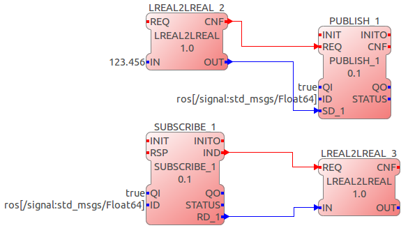
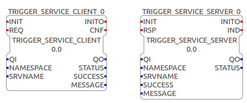
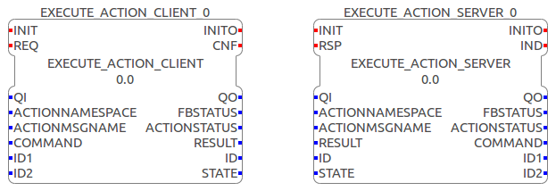

[[topOfPage]]
= ROS with IEC 61499 Tutorial

== How to use Eclipse 4diac's ROS Communication Interface

Eclipse 4diac supports ROS communication for ROS topics, services and
actions. ROS topics have been implemented as a communication layer in
4diac FORTE, whereas services and actions require customized ROS
function blocks. The implementation was tested with ROS indigo and on
Ubuntu 14.04. Other versions (ROS or Ubuntu) might cause problems during
the execution of the ROS Eclipse 4diac communication interface. The
Example service and action FBs can be used to implement your own IEC
61499 compliant communication FBs for the datatypes you need. The ROS
communication layer for topics can easily be extended by adding the
IEC61499-ROS mapping of other datatypes.

Prerequisites:

. ROS indigo installed on Ubuntu 14.04.
. 4diac IDE installed
. CMake

[[build]]
=== How to Build 4diac FORTE with ROS Functionalities

. Clone 4diac FORTE and switch to the develop branch
+
$ git clone
git://git.eclipse.org/gitroot/4diac/org.eclipse.4diac.forte.git $ cd
org.eclipse.4diac.forte $ git checkout develop
. Source indigo installation and start cmake from this "sourced" command
line:
+
$ source /opt/ros/indigo/setup.bash $ cmake-gui
. Press "configure" and set the appropriate CMake variables
+
FORTE_ARCHITECTURE=Posix CMAKE_BUILD_TYPE=Debug FORTE_MODULE_ROS=On
FORTE_RTTI_AND_EXCEPTIONS=TRUE
. After that press "configure" again until the red fields disappear and
then press "generate" and build 4diac FORTE with:
+
$ cd "/path/to/your/forte/build/directory" $ make
. Source your workspace (in the command line where you want to start
4diac FORTE) and start a ROS core (on a different command line):
+
$ source "/path/to/your/forte/build/directory"/devel/setup.bash $
roscore
. Start 4diac FORTE:
+
$ cd [/path/to/your/forte/build/directory]/src $ ./forte

[[topics]]
=== ROS Topics

4diac FORTE implements a Communication Layer for standard ROS topics.
Use the PUBLISH_0 / SUBSCRIBE_0 and PUBLISH_1 / SUBSCRIBE_1 function
blocks with the following datatypes:

[cols=",",options="header",]
|===
|ROS |IEC61499
|std_msgs/Empty |- (empty)
|std_msgs/Float64 |LREAL
|std_msgs/Bool |BOOL
|std_msgs/Int32 |DINT
|std_msgs/String |STRING
|===

The ID data input for a communication layer contains the protocol and a
string of vendor specific parameters and looks like this:

....
protocol[parameter]
....

In our case the protocol string is ros. the parameters in square
brackets are a ROS-topic namespace and/or name and its corresponding ROS
message type, separated by a colon. In general the ID for a ROS publish
or subscribe function block looks like this:

....
ros[topic_name:message_name]
....

An example of a ROS publish and subscribe connection within 4diac FORTE
is shown next.

[[services]]
=== ROS Services

The current implementation of ROS Services is limited to a single
service type which is
http://docs.ros.org/kinetic/api/std_srvs/html/srv/Trigger.html[std_srvs/Trigger].
This service client and server function block can be used as a template
to implement the ROS communication function blocks for your specific
application. The interfaces of the trigger service client and server are
shown next. +
 +
A brief Interface description is given by the next 2 tables that show
event and data connections of the implemented ROS function blocks. +

[cols=",",options="header",]
|===
|Event Name |Description
|CLIENT |

|INIT+ |Initialize Client FB

|INIT- |Terminate Client FB

|REQ |Send a ROS service request to the connected server

|CNF |Client FB successfully received a response from the server

|SERVER |

|INIT+ |Initialize Server FB

|INIT- |Terminate Server FB

|IND |Server FB received a request from the connected client

|RSP |Send a response to the client (e.g. when the FBN finished
processing the request)
|===

 +

[cols=",,",options="header",]
|===
|Data Name |Data Type |Description
|QI |BOOL |Qualifier input

|NAMESPACE |STRING |Namespace of the service

|SRVNAME |STRING |Name of the service

|QO |BOOL |Qualifier output

|STATUS |STRING |Status of the FB

|SUCCESS |BOOL |Value related to response.success in
std_srvs/Trigger.srv

|MESSAGE |STRING |Value related to response.message in
std_srvs/Trigger.srv
|===

[[actions]]
=== ROS Actions

The ROS action type which is currently supported by Eclipse 4diac is
reapp_msgs/Execute.action. Its definition is shown next.

....
#goal
string command
int32 id1
int32 id2
---
#result
string result
int32 id
---
#feedback
string state
....

You can install this action on Ubuntu 14.04 running ROS indigo via:

....
sudo apt-get install ros-indigo-reapp-msgs
....

The interface of the client and server FBs is shown in the following
figure and described in the diagrams below: +
 +

[cols=",",]
|===
|Event Name |Description

|CLIENT |

|INIT+ |Initialize Client FB

|INIT- |Terminate Client FB

|REQ+ |Send a ROS action goal to the connected server

|REQ- |Cancel the current ROS action goal to the connected server

|CNF+ |Client FB received a result from the server

|CNF- |Client FB received feedback from the server

|SERVER |

|INIT+ |Initialize Server FB

|INIT- |Terminate Server FB

|IND |Server FB received a goal from the connected client

|RSP+ |Send the result to the client (e.g. when the FBN finished
processing the goal)

|RSP- |Send feedback to the client (e.g. intermediate results during
processing)
|===

 +
the data in and outputs of the execute action FBs can be described as
shown next: +

[cols=",,",]
|===
|Data Name |Data Type |Description

|QI |BOOL |Qualifier input

|ACTIONNAMESPACE |STRING |Namespace of the action

|ACTIONMSGNAME |STRING |Name of the action

|COMMAND |STRING |Value related to goal.command in
reapp_msgs/Execute.action

|ID1 |DINT |Value related to goal.id1 in reapp_msgs/Execute.action

|ID2 |DINT |Value related to goal.id2 in reapp_msgs/Execute.action

|QO |BOOL |Qualifier output

|FBSTATUS |STRING |Status of the FB

|ACTIONSTATUS |STRING |Status of the action server

|RESULT |STRING |Value related to result.result in
reapp_msgs/Execute.action

|ID |DINT |Value related to result.id in reapp_msgs/Execute.action

|STATE |STRING |Value related to feedback.state in std_srvs/Trigger.srv
|===

 +
A typical workflow with the execute action client would be to initialize
it (INIT+), synchronise the appropriate data for the goal and send the
goal (REQ+). When the goal is processed at the server the server may
(depending on the implmentation) send feedback to the client. This
feedback is recognized by the block via a negative confirm (CNF-). As
soon as the server sends the result the client will get the result that
is synchronized at the RESULT and ID data outputs of the function block
and a positive confirm is triggered (CNF+). Testing and debugging of the
action server and client can easily be done with the axserver/ axclient
provided by ROS. An axserver that connects to an execute action client
within Eclipse 4diac with the configuration

....
ACTIONNAMESPACE=test_execute
ACTIONMSGNAME=localisation
....

can be started like this:

....
rosrun actionlib axserver.py test_execute/localisation reapp_msgs/ExecuteAction
....

== Where to go from here?

Go back to Protocols index:

xref:index.adoc[Communication Index]

If you want to go back to the Start Here page, we leave you here a fast
access

xref:../index.adoc[Start Here page]

Or link:#topOfPage[Go to top]
