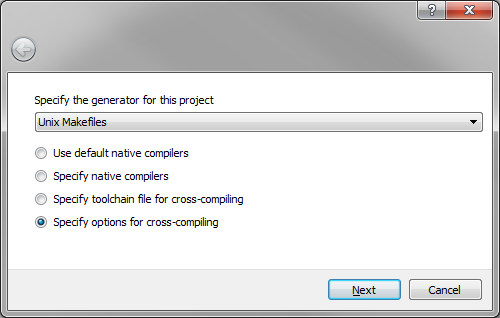

= [[topOfPage]]Building 4diac FORTE for freeRTOS + LwIP
:lang: en

== Introduction

This guide is for compiling 4diac FORTE for freeRTOS and LwIP. 
https://www.freertos.org/[freeRTOS] is a free real-time operative system which is not attached to a specific hardware, but it can run in many different ones. 
The operative system is very small and simple, and initially didn't have any TCP/IP support, that's why a common practice
was to use it together with https://savannah.nongnu.org/projects/lwip/[LwIP], a small TCP/IP stack.
freeRTOS now also have an extra support for TCP/IP (see https://www.freertos.org/FreeRTOS-Plus/FreeRTOS_Plus_TCP/index.html[here]) but for now 4diac FORTE is compiled using LwIP.

This guide helps you make 4diac FORTE run on some hardware where freeRTOS and LwIP are already able to run. 
Since you can be using any hardware, no support for IO is provided here and this guide will help you compile 4diac FORTE as a static library that you can later add to some project you already have working on your hardware, so the following points are assumed before starting this guide

* You have and IDE and a compiler installed in your computer that allows you to compile code to your hardware (from now on, cross-IDE and
cross-compiler),
* You have an example using freeRTOS and LwIP running in your hardware, meaning that the freeRTOS and LwIP code are present in your computer, and
* you have a basic understanding of tasks of freeRTOS

If you checked all points before, keep going. 
If you don't have a freeRTOS and LwIP example this guide won't help you much.

== Set CMake and compile

. Open CMake-GUI and complete as shown in the image
.. Set the 4diac FORTE source path where you cloned the Git repository.
.. Set path for binaries where you want to create the library. Normally, `bin/freeRTOS` is used.
.. Press [.button4diac]#Configure#
+

. Select the correct option
.. Select the tool you normally use to compile your programs. This
example follows using UNIX Makefiles from the list.
.. Select [.button4diac]#Specify tools for cross-compiling.#(you can
also do it selecting "Specify toolchain file for cross-compiling" but
that requires that you create the file first, which if you can do it
later when you have more experience with CMake)
.. Press [.button4diac]#Next#
+

. Setup for cross-compilation
.. Write a name for the OS (normally freeRTOS, it won't affect the compilation).
.. Select the path to the C cross-compiler for your hardware. 
   This you can look for in the properties of your project in your cross-IDE.
.. Select the path to the C++ cross-compiler for your hardware. 
   This you can look for in the properties of your project in your cross-IDE.
.. The target root field can be left empty.
.. Click [.button4diac]#Finish#
+
image:./img/raspiCrossLinux3.png[Select cross-compiling tools.]
. Configure the compilation
+
A list with all variables of 4diac FORTE in red should be shown in CMake.
.. Set the FORTE_ARCHITECTURE variable to FreeRTOSLwIP and click Configure
.. Check the information that appears in CMake about the LwIP configuration.
.. The variable FORTE_FreeRTOSLwIP_INCLUDES should appear now and it is the most important one. 
   You should set it to the several paths where the freeRTOS and LwIP headers are, each separated by a semicolon. 
   For example: `$\{MAIN_DIRECTORY}/FreeRTOS/portable;$\{MAIN_DIRECTORY}/include;$\{MAIN_DIRECTORY}/lwip/src/include;$\{MAIN_DIRECTORY}/lwip/port` where `$\{MAIN_DIRECTORY}` is the path where you have your freeRTOS and LwIP code. 
   When you later compile and it fails with an error saying that some "includes" are missing, this variable should be updated where the folders where the missing files are located. 
.. It might be the case that you also need to set the CMAKE_C_FLAGS and CMAKE_CXX_FLAGS variables with the flags needed for your hardware. 
   You can check which flags you need from the proeperties of your example project in your cross-IDE.
.. Set FORTE_BUILD_EXECUTABLE to false and FORTE_BUILD_STATIC_LIBRARY to true.
.. Click [.button4diac]#Configure# and the variables that need revision will appear again in red and the rest in white. 
   Check these variables and press [.button4diac]#Configure# until no variable is shown in red. 
   Here you can add the modules that you want 4diac FORTE to have, but from the freeRTOS point of view, there's nothing else you need.
. Generate files
* Click [.button4diac]#Generate#
. Build 4diac FORTE
* Go to the recently generated folder and execute make (or build it as you normally do)
+
`$ cd bin/freeRTOS $ make`
+
* If no error occurred, you'll have a file called libforte-static.a under the [.folderLocation]#bin/freeRTOS/src# folder. 
  If you got an error, check again the variables in CMake, specially FORTE_FreeRTOSLwIP_INCLUDES, CMAKE_C_FLAGS and CMAKE_CXX_FLAGS.

== Add the 4diac FORTE library to your project

. Add the recently compiled library (libforte-static.a) to your project, this step depends on the cross-IDE you have.
. Copy the file `src/arch/freeRTOS/forte_Init.h` to your project.
. In your file where your "main" function is located, you need to include forte_Init.h and add a task that will start the "forte_thread" task. 
  A working example of the task running 4diac FORTE is as follow (PRINTF can cause problems, so change it to your logging function or
delete it):

---- 
static void forte_thread(void *arg) { 
    forteGlobalInitialize();
    TForteInstance forteInstance = 0; 
    int resultForte = forteStartInstanceGeneric(0, 0, &forteInstance); 
    if(FORTE_OK == resultForte) { 
         forteJoinInstance(forteInstance); 
    } else { 
        PRINTF("Error %d: Couldn't start forte\n", resultForte); 
    } 
    forteGlobalDeinitialize();
    vTaskDelete(NULL); 
}
----

If everything is Ok, 4diac FORTE will start and you'll be able to deploy to it on port 61499. 
If you have some problems, read the following section

== Troubleshooting

It's probable that 4diac FORTE doesn't run in the first try. You should take care of the following:

* Make sure that you have a good amount of RAM available in your system for the stack and heap memory. 
  To see if your system is running out of memory, in your FreeRTOSConfig.h make sure you have:
+  
----
#define configCHECK_FOR_STACK_OVERFLOW 1 #define
configUSE_MALLOC_FAILED_HOOK 1
----
+
And add the following functions to your main file:
+
----
void vApplicationMallocFailedHook() { 
   for(;;) {
       vTaskDelay(pdMS_TO_TICKS(1000)); 
   } 
} 

void vApplicationStackOverflowHook(TaskHandle_t xTask, char *pcTaskName ) { 
    for(;;) {
        vTaskDelay(pdMS_TO_TICKS(1000)); 
    } 
}
----
+
and put a breakpoint in both vTaskDelay. If the programs reaches one of these breakpoints, you have a memory problem.
* You should configure your hardware and start the LwIP task before 4diac FORTE.
* A configuration of task creation that worked for some users is:
. Create a Task called "stack_init"
. Start scheduler
. "stack_init" will run and initialize the LwIP stack (which internally creates a LwIP task)
. After that, "stack_init" creates the "forte_thread" task as seen before
. "stack_init" finishes with vTaskDelete(NULL);
* For C++ projects (like 4diac FORTE) a call to `__libc_init_array();` is needed. 
  In some cases this is not done by default by the generated code of the example. 
  Try adding this call right at the beginning of the main() function before any other call.

== [[whereToGoFromHere]]Where to go from here?

Now that you installed the required tools, it's time to start using them. 
Take a look at the following tutorials:

xref:../tutorials/overview.adoc[Step 0 - 4diac IDE Overview]

If you want to compile 4diac FORTE for another platform or want to know more about that, here's a quick link back:

xref:./install.adoc[Install Eclipse 4diac]

If you want to go back to the Start Here page, we leave you here a fast
access

xref:../index.adoc[Where to Start]

Or link:#topOfPage[Go to top]
