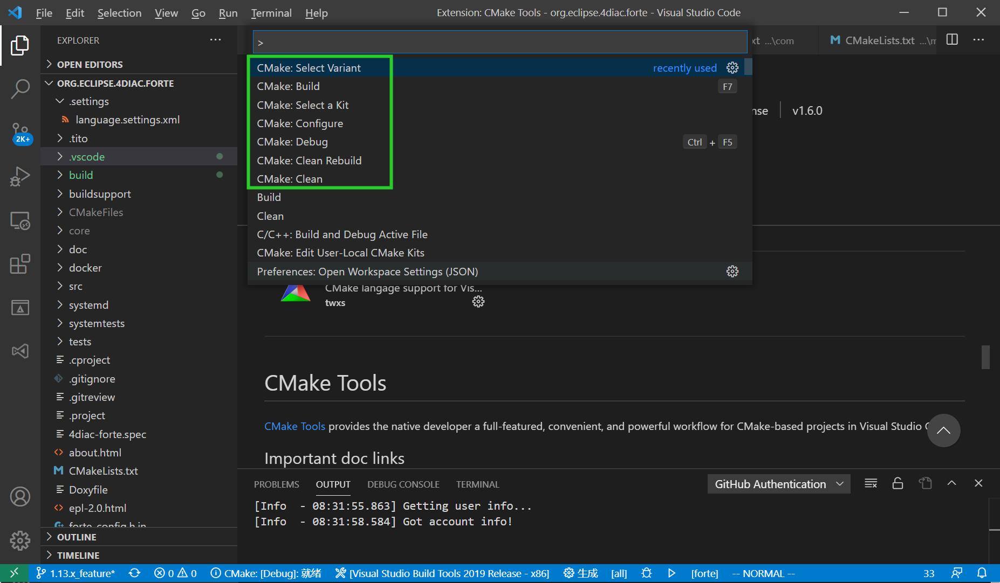
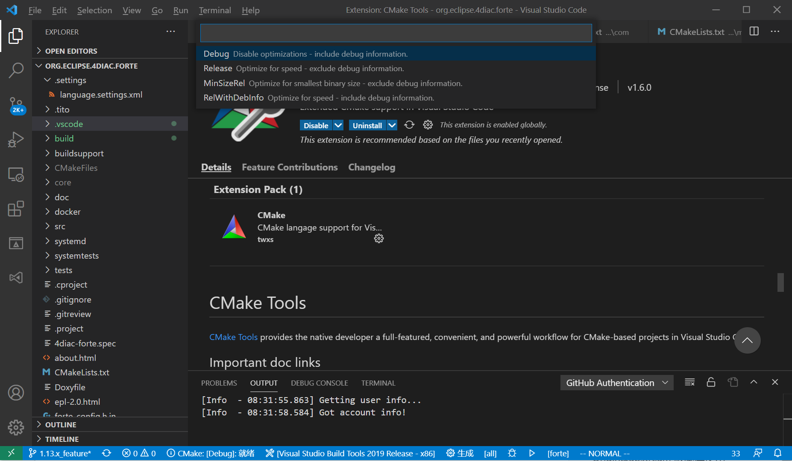

= [[topOfPage]]Compiling and Debugging 4diac FORTE with MS Visual Studio Code
:lang: en

The following describes how to compile 4diac FORTE with win32-architecture using Visual Studio Code. 
In the installation tutorial xref:./install.adoc#ownFORTE[(back)] you find more details on building your own 4diac FORTE. 
Additionally, visual studio code is described there.

== Building a MS Visual Studio Code Project for 4diac FORTE with CMake

In the xref:./install.adoc#ownFORTE[installation tutorial], the steps on building a project with CMake are described in detail. 
To use Visual Studio Code with CMake, you need to specify the options (All the options are shown in CMake-GUI when you choose source
folder FORTE_FOLDER_ROOT, refer to xref:./install.adoc#generateFilesForCompiling[Build a project with CMake].) for CMake in settings.json for the project in Visual Studio Code.
The correct architecture is Win32. 
Below is an example of settings.json for forte with OPC DA compiled.

----
{ "cmake.configureOnOpen": false, 
  "cmake.configureSettings": {
     "FORTE_ARCHITECTURE:STRING": "Win32", //Enable 4diac FORTE Com FBDK
     "FORTE_COM_FBDK:BOOL": "ON", //Enable 4diac FORTE Com Ethernet
     "FORTE_COM_ETH:BOOL": "ON", //Enable 4diac FORTE local communication
     "FORTE_COM_LOCAL:BOOL": "ON", //IEC61131-3 Function blocks
     "FORTE_MODULE_IEC61131:BOOL": "ON", "FORTE_MODULE_UTILS:BOOL": "ON",
     "FORTE_MODULE_CONVERT:BOOL": "ON", //Loglevel to use
     "FORTE_LOGLEVEL:STRING": "LOGDEBUG", 
     "CMAKE_BUILD_TYPE:STRING": "debug",
     "FORTE_COM_OPC":"ON", 
     "FORTE_COM_OPC_LIB_ROOT": "D:/4diac/OPC-Client-X64/",
     "FORTE_COM_OPC_BOOST_ROOT": "D:/4diac/boost_1_84_0/",
  } 
}
----

== Compile and debug 4diac FORTE with Visual Studio Code

. Install compiler. 
  For example, msbuild tools if you want to compile OPC DA, install the components according to xref:../communication/opc.adoc#msbuildtools[ms buildtools]. 
  Or if you prefer mingw-w64, follow xref:./minGW.html[mingw-w64]. 
. Install "CMake tools" plugin in visual studio code.
. Open command palette(ctrl + shift + p), compile or debug in below command:
+
----
cmake:select a kit;   //choose MINGW64, msbuildtools or gcc 
cmake:select variant; //debug or release 
cmake:configure; 
cmake:build           //compile
cmake:debug
----
+

. When you choose debug or release, do make the cmake option `CMAKE_BUILD_TYPE` in settings.json align with the `cmake:select variant`.
+

== [[whereToGoFromHere]]Where to go from here?

If you want to build a 4diac FORTE, here is a quick link back:

xref:./index.adoc[Install Eclipse 4diac]

After you installed all required tools, it's time to start using them.
Take a look at the following page:

xref:../tutorials/overview.adoc[Step by step tutorial]

If you want to go back to the Start Here page, we leave you here a fast
access

xref:../index.adoc[Start Here page]

Or link:#topOfPage[Go to top]
