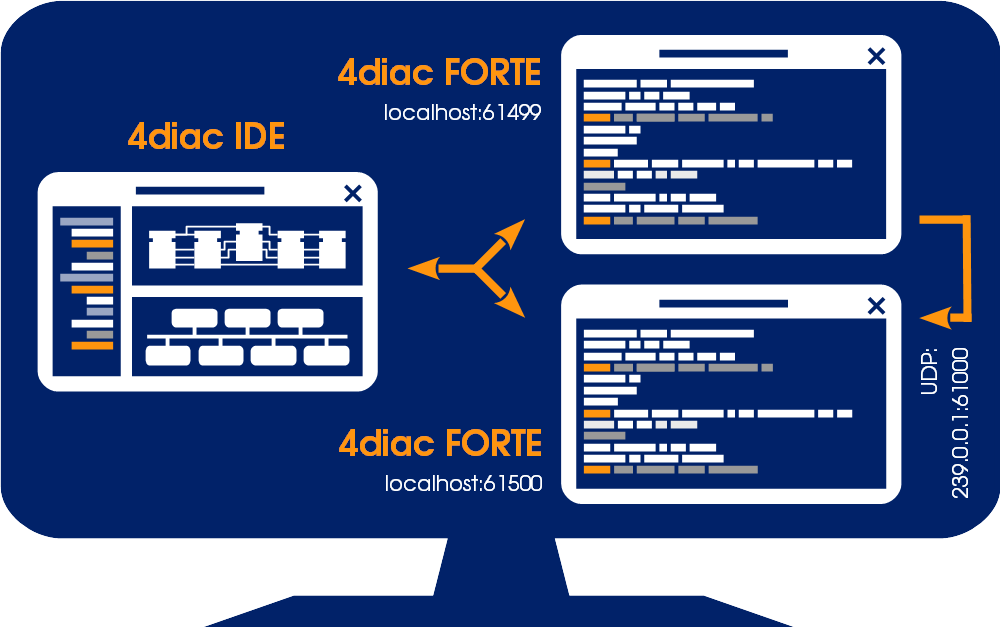
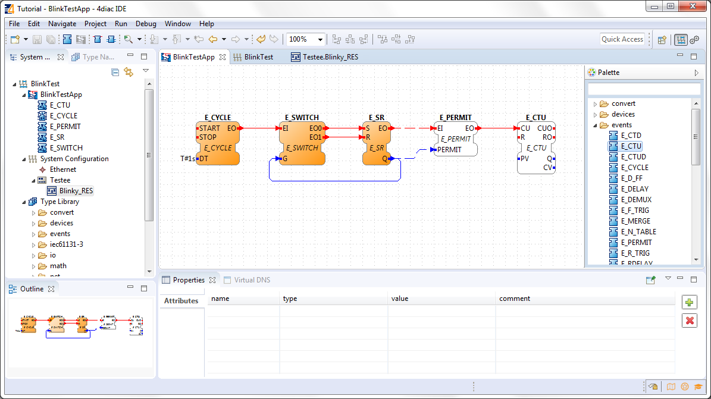
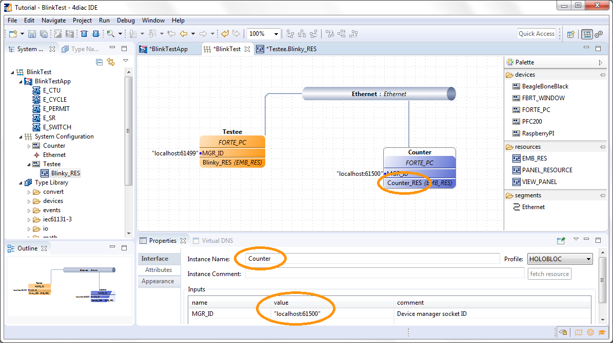
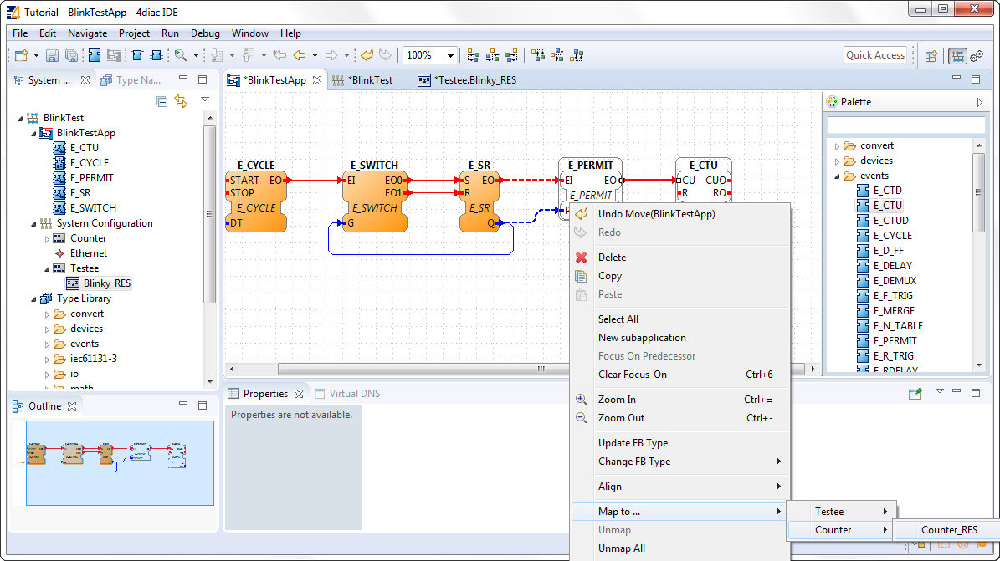
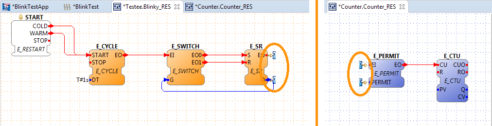
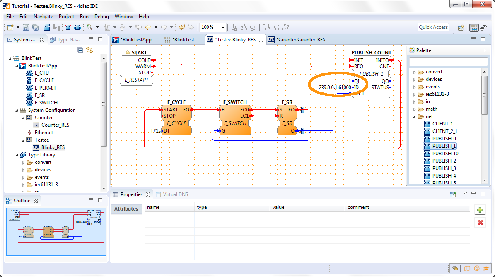
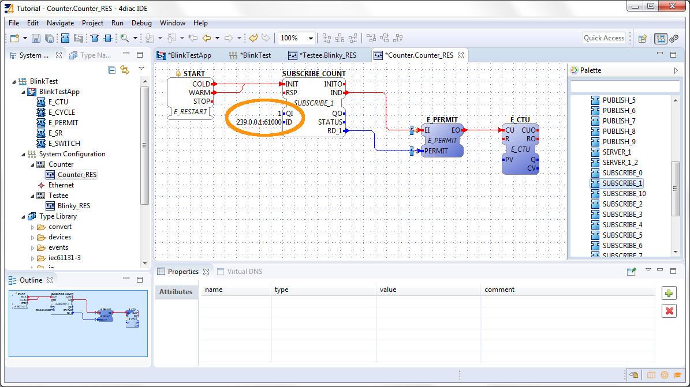
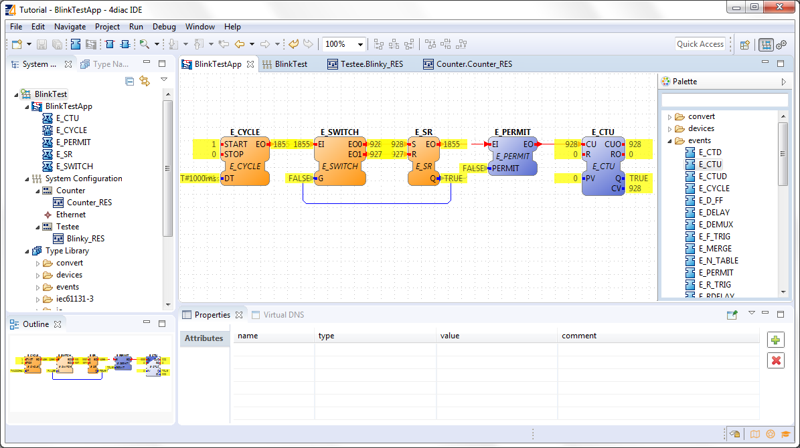

= [[topOfPage]]Step 2 - Distribute 4diac Applications
:lang: en

This page is part of a guide that gives a walk-through over the major 4diac IDE features.

[start=0]
. xref:overview.adoc[4diac IDE Overview]
. xref:use4diacLocally.adoc[Use 4diac Locally (Blinking tutorial)]
. Distribute 4diac Applications (YOU ARE HERE!)
. xref:use4diacRemotely.adoc[Deploy Applications Remotely]
. xref:createOwnTypes.adoc[Create Your own Function Block Types]
. xref:otherUseful.adoc[Other Basic Features]
. xref:advancedFeatures.adoc[Advanced Features]
. xref:dynamicTypeLoader.adoc[Deploying new FBs with the Dynamic Type Loader]

This guide extends the blinking application of xref:./use4diacLocally.adoc[Step 1]. 
We want to count how many times the light has turned on. 
You will learn how to distribute a IEC 61499 Application to several devices and set up the communication between them. 
The example continues to run on the local computer. 
The application will run on 2 devices. 
The blinking part of the application will run on a 4diac FORTE and the count on another 4diac FORTE, see the architecture below. 
The two different programs running on the local machine emulate two PLCs. 

== [[extendApplication]]Extend the Application

To count the blinking, we need to add 2 new Function Blocks (FBs) to the existing Application in the _BlinkTestApp_ Application Editor.

. Drag and Drop the following FBs from the folder events of the Palette.
* `E_PERMIT`
* `E_CTU`
. Create the connections between the FBs.

Remember, Event and Data connections can not be mixed.

== [[AddAnotherDevice]]Add Another Device

Change to the _BlinkTest_ System Configuration Editor and add a second device from the Palette. 
The counter will run on the new device.

. Drag and Drop a *FORTE_PC* device next to the existing one.
. Rename the device to *Counter*.
. Set the localhost to 61500. 
  The devices need to have different localhosts, they can not have the same one.
. Rename the resource to *Counter_RES*.

Change back to the _BlinkTestApp_ Application Editor and map the two new FBs to the Resource _Counter_RES_. 
You can see the dashed connections between the two devices.

== [[SetUpCommunication]]Set up the Communication Between Both Devices

Change to the _Testee.Blinky_RES_ or _Counter.Counter_RES_ Resource Editor. 
There you can see 2 incomplete FBs at the E_SR FB or E_PERMIT. 
They symbolize the broken connections between the two devices. 
Currently they have no opportunity to communicate with each other. 
We fix it by adding special Communications FBs. 
You can find more information about broken connections xref:../intro/iec61499.html#brokenConnection[here on our Homepage].

=== [[SetUpBlinking]]Set up the Blinking Part of the Application

Change to the _Testee.Blinky_RES_ Resource Editor.

Drag and Drop a *PUBLISH_1* FB from the folder net of the Palette and set up the connections. 
The PUBLISH FB must be initialized, so it is best to connect its INIT event directly to the START.

Set the `QI` value to `1` and the set the `ID` input data of the `PUBLISH_COUNT` FB to `239.0.0.1:61000`.

=== [[SetUpCounting]]Set up the Counting Part of the Application

Change to the `Counter.Counter_RES` Resource Editor.

Drag and Drop a *SUBSCRIBE_1* FB from the folder net of the Palette and set up the connections. 
The SUBSCRIBE FB must also be initialized.

Set the `QI` value to `1` and the set the `ID` input data of the `SUBSCRIBE_COUNT` FB to `239.0.0.1:61000`.

=== [[BackgroundCommunicationFBs]]Background of the Communication FBs

Here is what the last steps mean. 
The PUBLISH_X FB is used to send messages over the network which are received by an according SUBSCRIBE_X FB. 
Every time a REQ is triggered, a message is sent according to the ID input. With the value of the ID input you can specify what specific network protocol you would like to use (e.g., MQTT, OPC UA). 
If you do not specify a dedicated protocol the default as defined in the https://www.holobloc.com/doc/ita/["IEC 61499 Compliance Profile for Feasibility Demonstrations"] is used. 
The number X in PUBLISH_X is the number of data elements that you want to send in the message. 
Since we are only sending one value we used PUBLISH_1.

The used ID value specifies an IP:PORT pair. 
The used "IEC 61499 Compliance Profile for Feasibility Demonstrations" defines that this is an UDP multi-cast address in a certain address  range. 
The selected 239.0.0.1 and port 61000 have nothing to do with the localhost:61499 or localhost:61500 use for configuring the devices. 
The first is a UDP multi-cast address use to send messages between devices, and the latter are TCP connections for deploying applications to devices and manage them. Take care of not using the same UDP socket for different PUBLISH_X/SUBSCRIBE_X pairs.

== [[startDevices]]Start Both Devices

Open the local console 2x

. Navigate to the folder where the forte.exe is saved.
. Open Forte with port 61499 and in the other cmd window with port 61500.
. The command looks like this: forte.exe -c localhost:port
. Select the elements to deploy. For this tutorial select our devices _Counter_ and _Testee_.
. Start the program by clicking the green execute button.

== [[testApplication]]Test it!

== Where to go from here?

* In the next step you will see how 4diac FORTE runs in another machine. +
xref:./use4diacRemotely.adoc[Step 3 - Deploy Applications Remotely]
* If you want to go back to the original Blinking application without buttons, here's a link +
link:./use4diacLocally.adoc[Step 1 - Use 4diac Locally (Blinking Tutorial)]
* If you want to go back to the Start Here page, we leave you here a fast access +
xref:../index.adoc[Where to Start]

link:#topOfPage[Go to top]
